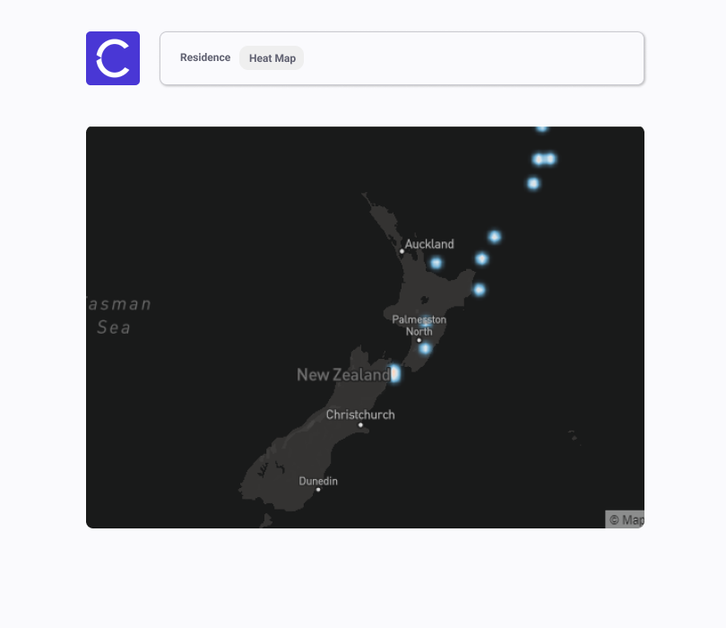

This is a residence registration project which provides data visualization of the registered residences by a heatmap.

## Running it locally

### How to run

- `git clone https://github.com/eduardogerentklein/residence-registration.git`
- `yarn`
- `yarn dev`
- `yarn server`

Open [http://localhost:3000](http://localhost:3000) with your browser to see the result.

Json-server routes can be accessed on [http://localhost:3004/\*resources](http://localhost:3004/*resources)

## Residence registration page

  
   
  Made using the collaborative interface design tool Figma

## HeatMap page

  
   
  Made using the collaborative interface design tool Figma

